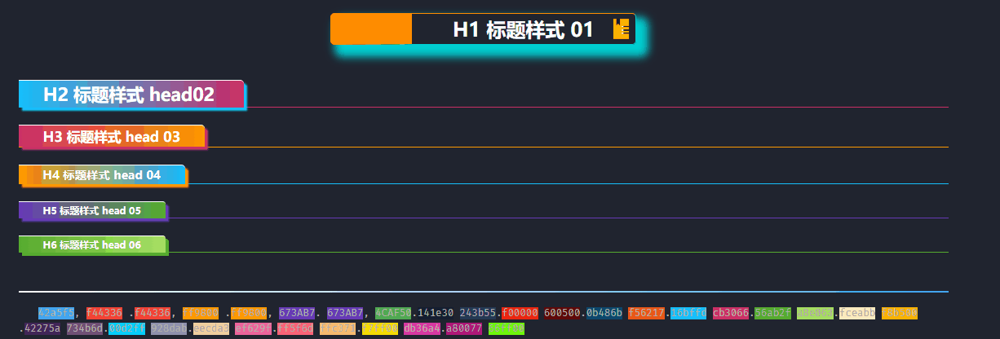
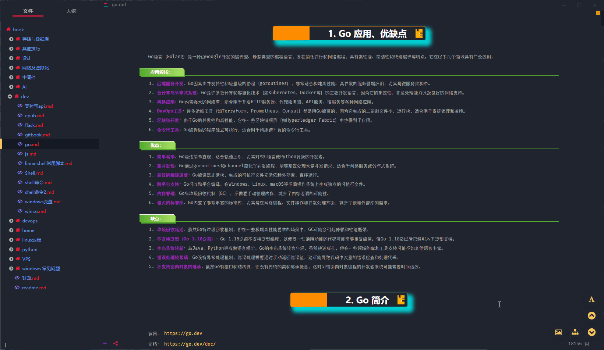
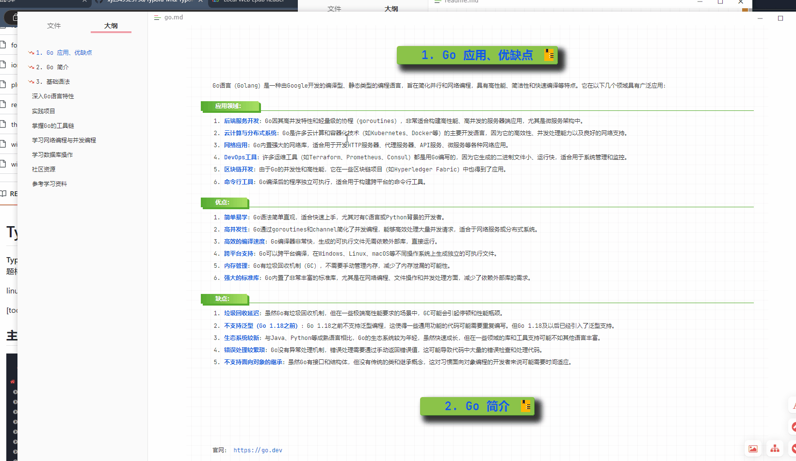
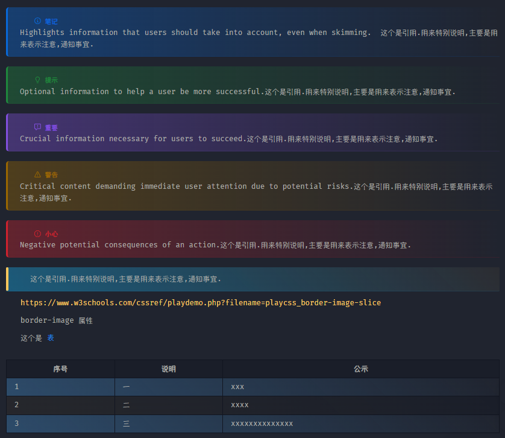
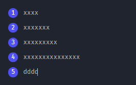
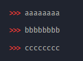
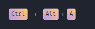
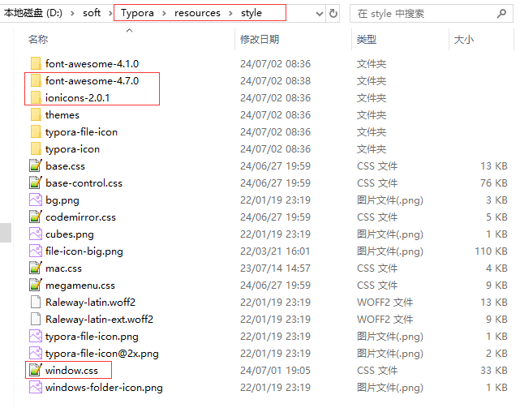
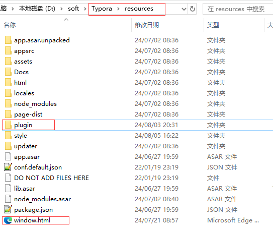
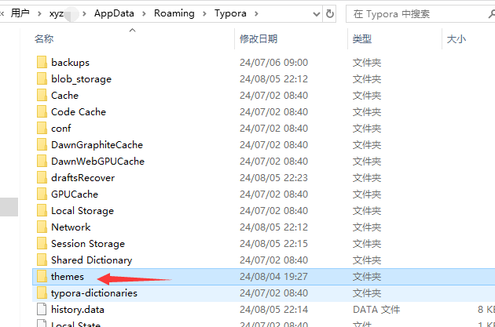

# Typora Mid

**Typora-Mid** 是一个基于 [DrakeTyporaTheme](https://github.com/liangjingkanji/DrakeTyporaTheme) 主题和 [typora_plugin](https://github.com/obgnail/typora_plugin) 插件修改整合的项目。它旨在美化 Typora 界面和标题样式，为用户提供更好的视觉体验和自定义选项。

linux OS、MacOS 并未做过测试，请尝试之前备份好覆盖的文件。


## 主题预览

标题样式



脑图/思维导图



侧边导航


亮色主题



导出为html/pdf 预览


引用样式



图上的引用如何使用？

格式 > [!xxx] 就可以实现

```shell
> [!NOTE]
> Highlights information that users should take into account, even when skimming.  这个是引用.用来特别说明,主要是用来表示注意,通知事宜.

> [!TIP]
> Optional information to help a user be more successful.这个是引用.用来特别说明,主要是用来表示注意,通知事宜.

> [!IMPORTANT]  
> Crucial information necessary for users to succeed.这个是引用.用来特别说明,主要是用来表示注意,通知事宜.

> [!WARNING]  
> Critical content demanding immediate user attention due to potential risks.这个是引用.用来特别说明,主要是用来表示注意,通知事宜.

> [!CAUTION]
> Negative potential consequences of an action.这个是引用.用来特别说明,主要是用来表示注意,通知事宜.


> 这个是引用.用来特别说明,主要是用来表示注意,通知事宜.
```

有序列表



无序列表



按键背景




## 资源下载

项目包含了字体和图标字体的修改

Font[可选]、 Font-awesome-4.7.0 、Windows.css、Theme、Plugin

```shell
$ git clone git@github.com:xyz349925756/Typora-Mid.git
$ cd Typora-Mid
```

> [!tip]
>
> 为了保证资源的安全性，并没有做一键批处理相关的脚本，所以需要手动覆盖文件。

## 使用说明

压缩文件替换说明

- font.zip 不安装使用系统默认的字体。

- font-awesome-4.7.0、ionicons-2.0.1、window.css 这三个文件放到 typora 的安装目录下的`\resources\style` 文件夹下，如图

  

- window.html、plugin 存放在 `resources` 文件夹下，如图

  

- themes 解压到 `C:\Users\换成你的用户名\AppData\Roaming\Typora`

  


> [!caution]
>
> 上面主题导出 html、pdf 图标都在，样式也在，但是主题有暗色和白色区别。


## 许可证

本项目使用 [MIT License](https://opensource.org/licenses/MIT)。

