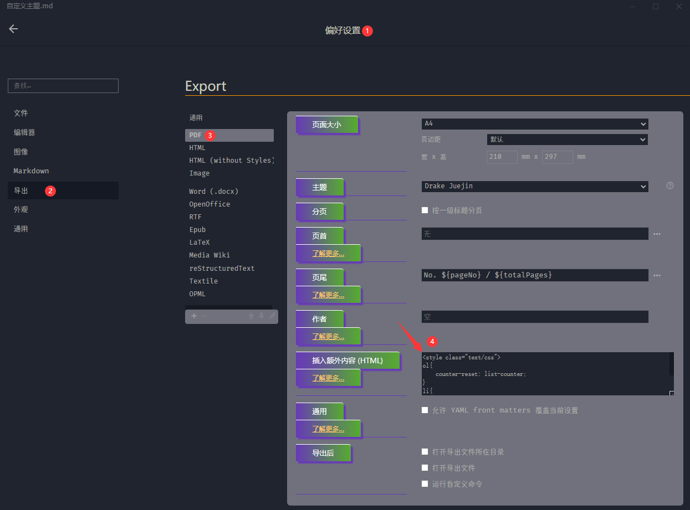
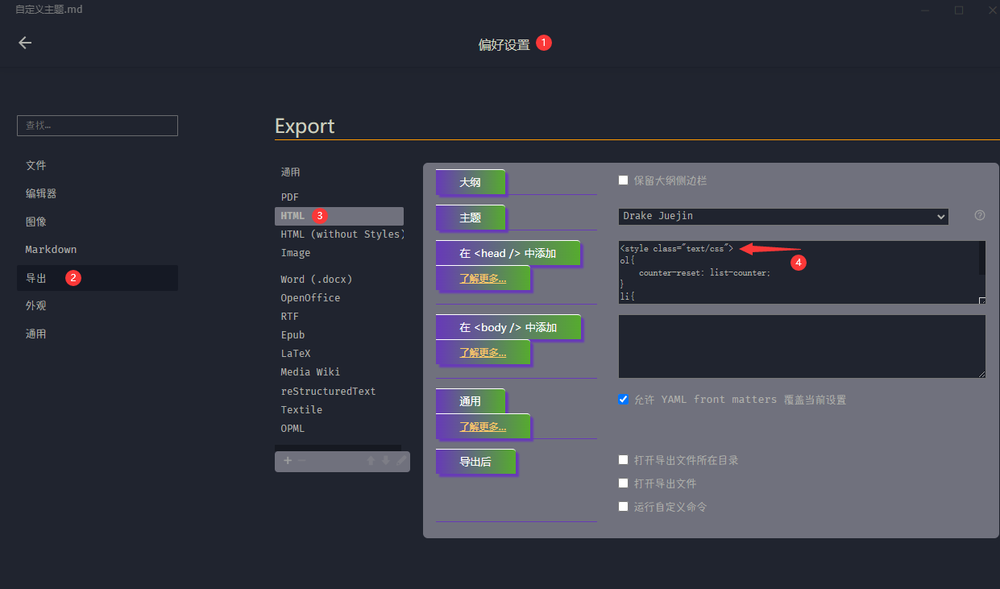

# Typora Mid

**Typora-Mid** 是一个基于 [DrakeTyporaTheme](https://github.com/liangjingkanji/DrakeTyporaTheme) 主题和 [typora_plugin](https://github.com/obgnail/typora_plugin) 插件修改整合的项目。它旨在美化 Typora 界面和标题样式，为用户提供更好的视觉体验和自定义选项。

为什么文件这么零散？

Typora-Mid 就是一个中间件，修主题改样式和图标、字体、插件几个项目整合起来的。 在不修改typora，typora_plugin 的基础上实现的。因为系统的差异性如果打包成固定的，会出现各种奇葩的问题，体验很好。


## 主题预览

### 标题样式


### 脑图/思维导图、有序、无序列表样式，


### 侧边导航


### 亮色主题


### 导出为html/pdf 预览


### 引用样式


图上的引用如何使用？

格式 > [!xxx] 就可以实现

```shell
> [!NOTE]
> Highlights information that users should take into account, even when skimming.  这个是引用.用来特别说明,主要是用来表示注意,通知事宜.

> [!TIP]
> Optional information to help a user be more successful.这个是引用.用来特别说明,主要是用来表示注意,通知事宜.

> [!IMPORTANT]  
> Crucial information necessary for users to succeed.这个是引用.用来特别说明,主要是用来表示注意,通知事宜.

> [!WARNING]  
> Critical content demanding immediate user attention due to potential risks.这个是引用.用来特别说明,主要是用来表示注意,通知事宜.

> [!CAUTION]
> Negative potential consequences of an action.这个是引用.用来特别说明,主要是用来表示注意,通知事宜.


> 这个是引用.用来特别说明,主要是用来表示注意,通知事宜.
```

### 有序列表


### 无序列表


### 按键背景


## 资源下载

项目包含了字体和图标字体的修改

目前为了方便直接打包成三个压缩包 font.zip 、themes.zip、resources.zip 操作说明参考下面的 [使用指导](##使用指导)。

```shell
$ git https://github.com/xyz349925756/Typora-Mid.git
$ cd Typora-Mid
```

> [!tip]
>
> 为了保证资源的安全性，并没有做一键批处理相关的脚本，所以需要手动覆盖文件。

## 使用指导

压缩文件替换说明

1. 懒人使用

   - font.zip 可选，默认使用当前用户的默认字体。
   
   
      - resources.zip 对应 typora 安装目录下的 resources 当前项目使用的是 typora 1.9.5 
   
   
      - themes.zip 对应
   
        `C:\Users\换成你的用户名\AppData\Roaming\Typora`
   
        目录下的theme
   
2. 动手能力强的使用，linux,macos 可以参考resources 中对应的文件。

   - font-awesome-4.7.0、ionicons-2.0.1、window.css 这三个文件放到 typora 的安装目录下的`\resources\style` 文件夹下，如图

     
   
   
      - window.html、plugin 存放在 `resources` 文件夹下，如图
   
        
   
   
      - themes 解压到 `C:\Users\换成你的用户名\AppData\Roaming\Typora`
   
        
   


> [!caution]
>
> 上面主题导出 html、pdf 图标都在，样式也在，但是主题有暗色和白色区别。

## 导出html/pdf设置

在导出html pdf  文件时添加下面的代码

```css
<style class="text/css">
ol{
	counter-reset: list-counter;
}
li{
    list-style: none;
    display: flex !important;
    align-items: center;
    flex-wrap: wrap;
    position: relative;      /* 为伪元素定位 */
    padding-left: 35px; 
}

ol > li:before {
    counter-increment: list-counter;
    content: counter(list-counter);
    background-color: #5050f1;
    color: white;
    padding: 1px 6px;
    margin-right: 5px;
    border-radius: 50%;
    position: absolute;
    left: 8px;
    top: 5px;
}

ol > li > p {
    padding-top: 5px;
    flex: 1 1 calc(100% - 50px);
}
ul > li:before {
    content: ">>>";
    color: #F44336;
    margin-right: 5px;
    position: absolute;
    left: 8px;
    top: 5px;
}
ul > li > p {
    padding-top: 5px;
    flex: 1 1 calc(100% - 50px);
}

li.md-task-list-item.task-list-item.task-list-done::before {
    content: "";
    background: var(--checkbox-checked) 0 0 no-repeat;
    background-size: 100%;
    display: inline-block;
    position: absolute;
    height: 1.6rem;
    width: 1.6rem;
    margin-left: -2em;
}

li.md-task-list-item.task-list-item.task-list-not-done::before {
    content: "";
    background: var(--checkbox-unchecked) 0 0 no-repeat;
    background-size: 100%;
    display: inline-block;
    position: absolute;
    height: 1.6rem;
    width: 1.6rem;
    margin-left: -2em;
}

</style>
```





现在导出的html pdf 文件就跟你看到的几乎一样了。pdf 的可以调整导出 a3 格式的效果很不错。
