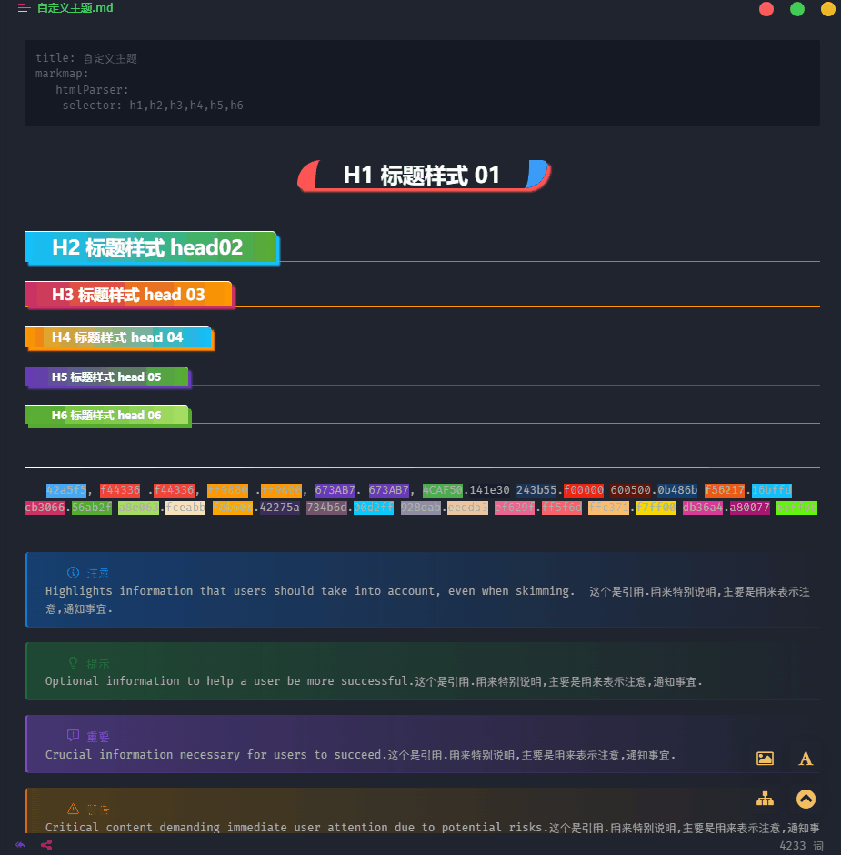
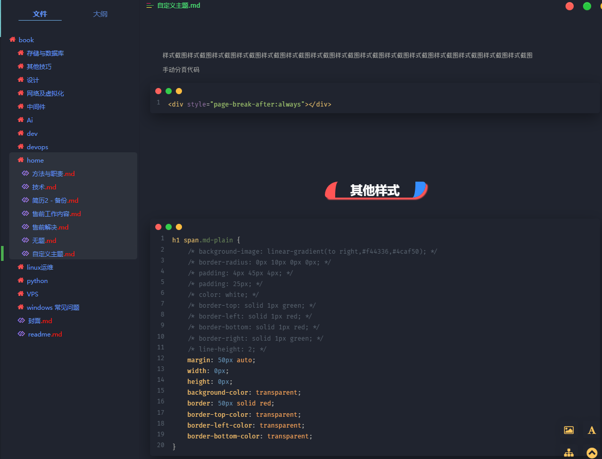
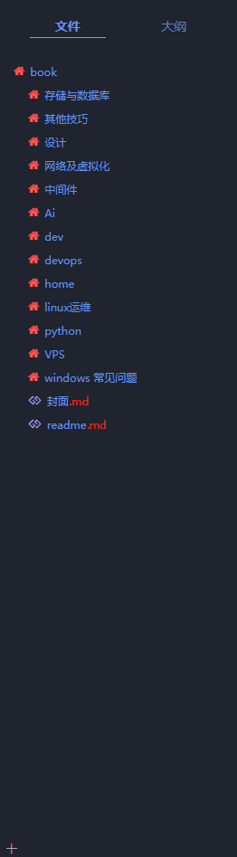
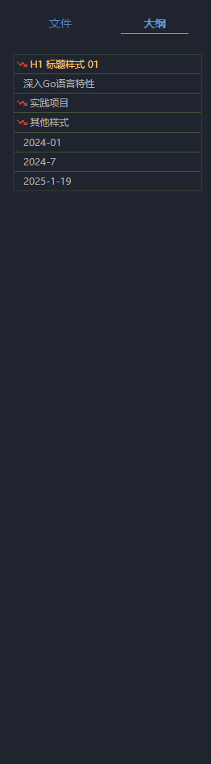
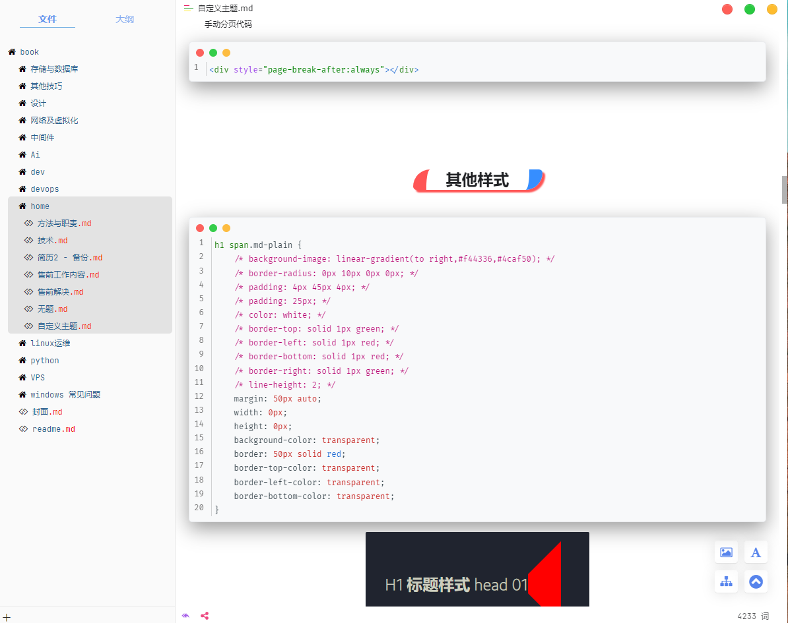

# Typora Mid

**Typora-Mid** 是一个基于 [DrakeTyporaTheme](https://github.com/liangjingkanji/DrakeTyporaTheme) 主题和 [typora_plugin](https://github.com/obgnail/typora_plugin) 插件修改整合的项目。它旨在美化 Typora 界面和标题样式，为用户提供更好的视觉体验和自定义选项。

为什么文件这么零散？

Typora-Mid 就是一个中间件，修主题改样式和图标、字体、插件几个项目整合起来的。 在不修改typora，typora_plugin 的基础上实现的。因为系统的差异性如果打包成固定的，会出现各种奇葩的问题，体验很好。

## update

[2025.2.24]

- 添加仿 mac 样式的按钮和代码块样式

> [!caution]
>
> 修改按钮样式是在 window.css  代码在下面[使用指导](##使用指导)


## 主题预览

### 标题样式




### 脑图/思维导图、有序、无序列表样式，




### 侧边导航





### 亮色主题





### 导出为html/pdf 预览


### 引用样式


图上的引用如何使用？

格式 > [!xxx] 就可以实现

```shell
> [!NOTE]
> Highlights information that users should take into account, even when skimming.  这个是引用.用来特别说明,主要是用来表示注意,通知事宜.

> [!TIP]
> Optional information to help a user be more successful.这个是引用.用来特别说明,主要是用来表示注意,通知事宜.

> [!IMPORTANT]  
> Crucial information necessary for users to succeed.这个是引用.用来特别说明,主要是用来表示注意,通知事宜.

> [!WARNING]  
> Critical content demanding immediate user attention due to potential risks.这个是引用.用来特别说明,主要是用来表示注意,通知事宜.

> [!CAUTION]
> Negative potential consequences of an action.这个是引用.用来特别说明,主要是用来表示注意,通知事宜.


> 这个是引用.用来特别说明,主要是用来表示注意,通知事宜.
```

### 有序列表


### 无序列表


### 按键背景


## 资源下载

项目包含了字体和图标字体的修改

目前为了方便直接打包成三个压缩包 font.zip 、themes.zip、resources.zip 操作说明参考下面的 [使用指导](##使用指导)。

```shell
$ git https://github.com/xyz349925756/Typora-Mid.git
$ cd Typora-Mid
```

> [!tip]
>
> 为了保证资源的安全性，并没有做一键批处理相关的脚本，所以需要手动覆盖文件。

## 使用指导

压缩文件替换说明

1. 懒人使用

   - font.zip 可选，默认使用当前用户的默认字体。
   
   
      - resources.zip 对应 typora 安装目录下的 resources 当前项目使用的是 typora 1.9.5 
   
   
      - themes.zip 对应
   
        `C:\Users\换成你的用户名\AppData\Roaming\Typora`
   
        目录下的theme
   
2. 动手能力强的使用，linux,macos 可以参考resources 中对应的文件。

   - font-awesome-4.7.0、ionicons-2.0.1、window.css 这三个文件放到 typora 的安装目录下的`\resources\style` 文件夹下，如图

     
   
   
      - window.html、plugin 存放在 `resources` 文件夹下，如图
   
        
   
   
      - themes 解压到 `C:\Users\换成你的用户名\AppData\Roaming\Typora`
   
        
   

window.css 按钮样式源码：

```css
/* 基础容器重置 */
#w-traffic-lights {
  display: flex !important;
  flex-direction: row-reverse !important;
  gap: 8px !important;
  padding: 6px 10px !important;
  position: fixed !important;
  top: 0 !important;
  right: 0 !important;
  z-index: 2147483647 !important;
  -webkit-app-region: no-drag !important;
}

/* 核心按钮样式锁定 */
#w-close, 
#w-min, 
#w-restore,
#w-max{
  width: 16px !important;
  height: 16px !important;
  border-radius: 50% !important;
  border: 0.5px solid rgba(0,0,0,0.06) !important;
  padding: 0 !important;
  position: relative !important;
  display: flex;
  align-items: center !important;
  justify-content: center !important;
  cursor: pointer !important;
  background: var(--btn-color) !important;
  box-shadow: 
      inset 0 1px 1px rgba(255,255,255,0.2),
      0 0.5px 1px rgba(0,0,0,0.08) !important;
  transition: none !important;
  margin: 0 5px;
}


/* 精确色彩定义 */
#w-close { --btn-color: #ff5f57 !important; }
#w-min { --btn-color: #febc2e !important; }
#w-max { --btn-color: #28c940 !important; }
#w-restore { --btn-color: #28c940 !important; }

/* 原生图标替换技术 */
#w-close .ty-close10,
#w-min .ty-minimize10,
#w-restore .ty-window-restore,
#w-max .ty-maximize10 {
  visibility: hidden !important;
  position: relative !important;
}

#w-close .ty-close10::before,
#w-min .ty-minimize10::before,
#w-restore .ty-window-restore::before,
#w-max .ty-maximize10::before {
  content: "";
  position: absolute !important;
  width: 12px !important;
  height: 12px !important;
  background: no-repeat center/7px;
}


/* 隐藏冗余元素 */
#w-full,
#w-pin,
#w-unpin,
/* #w-restore, */
#w-max-group > :not(#w-max) {
  display: none !important;
} 

/* 状态锁定 */
#w-traffic-lights .btn:hover,
#w-traffic-lights .btn:active {
  filter: none !important;
  transform: none !important;
  opacity: 1 !important;
} 

/* SVG图标注入 */
#w-close .ty-close10::before {
  background-image: url("data:image/svg+xml,%3Csvg width='8' height='8' viewBox='0 0 8 8' fill='none' xmlns='http://www.w3.org/2000/svg'%3E%3Cpath d='M1.707 1.707a1 1 0 0 0 0 1.414L6.293 7.7a1 1 0 1 0 1.414-1.414L3.12 1.707a1 1 0 0 0-1.414 0z' fill='rgba(0,0,0,0.5)'/%3E%3Cpath d='M6.293 1.707a1 1 0 0 1 0 1.414L1.707 7.7a1 1 0 1 1-1.414-1.414L4.88 1.707a1 1 0 0 1 1.414 0z' fill='rgba(0,0,0,0.5)'/%3E%3C/svg%3E");
}

#w-min .ty-minimize10::before {
  background-image: url("data:image/svg+xml,%3Csvg width='8' height='2' viewBox='0 0 8 2' fill='none' xmlns='http://www.w3.org/2000/svg'%3E%3Cpath d='M1 1h6' stroke='rgba(0,0,0,0.5)' stroke-width='1.2' stroke-linecap='square'/%3E%3C/svg%3E");
}

#w-max .ty-maximize10::before {
  background-image: url("data:image/svg+xml,%3Csvg width='8' height='8' viewBox='0 0 8 8' fill='none' xmlns='http://www.w3.org/2000/svg'%3E%3Cpath d='M3 1h4v4M1 3v4h4' stroke='rgba(0,0,0,0.5)' stroke-width='1.2' stroke-linecap='square'/%3E%3C/svg%3E");
}
```


> [!caution]
>
> 上面主题导出 html、pdf 图标都在，样式也在，但是主题有暗色和白色区别。

## 导出html/pdf设置

在导出html pdf  文件时添加下面的代码

```css
<style class="text/css">
ol{
	counter-reset: list-counter;
}
li{
    list-style: none;
    display: flex !important;
    align-items: center;
    flex-wrap: wrap;
    position: relative;      /* 为伪元素定位 */
    padding-left: 35px; 
}

ol > li:before {
    counter-increment: list-counter;
    content: counter(list-counter);
    background-color: #5050f1;
    color: white;
    padding: 1px 6px;
    margin-right: 5px;
    border-radius: 50%;
    position: absolute;
    left: 8px;
    top: 5px;
}

ol > li > p {
    padding-top: 5px;
    flex: 1 1 calc(100% - 50px);
}
ul > li:before {
    content: ">>>";
    color: #F44336;
    margin-right: 5px;
    position: absolute;
    left: 8px;
    top: 5px;
}
ul > li > p {
    padding-top: 5px;
    flex: 1 1 calc(100% - 50px);
}

li.md-task-list-item.task-list-item.task-list-done::before {
    content: "";
    background: var(--checkbox-checked) 0 0 no-repeat;
    background-size: 100%;
    display: inline-block;
    position: absolute;
    height: 1.6rem;
    width: 1.6rem;
    margin-left: -2em;
}

li.md-task-list-item.task-list-item.task-list-not-done::before {
    content: "";
    background: var(--checkbox-unchecked) 0 0 no-repeat;
    background-size: 100%;
    display: inline-block;
    position: absolute;
    height: 1.6rem;
    width: 1.6rem;
    margin-left: -2em;
}

</style>
```


现在导出的html pdf 文件就跟你看到的几乎一样了。pdf 的可以调整导出 a3 格式的效果很不错。
